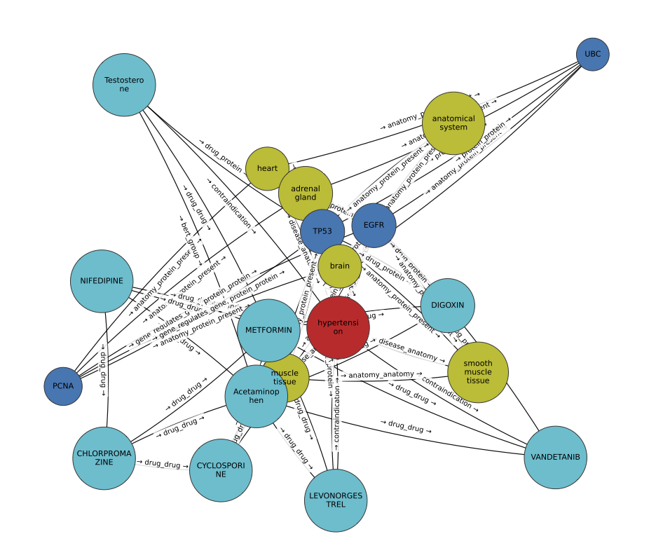
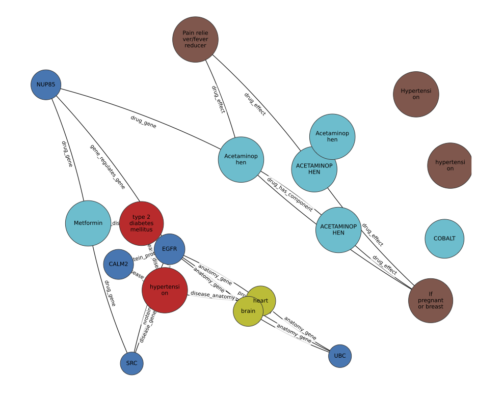

# 3. Fusion Graphs

The fusion graph experiments extend GRASP to cross-graph reasoning by combining biomedical and regulatory knowledge sources.  
This section documents the code workflow and schematic design of each fusion process, focusing on alignment, normalization, and integration logic.

---

## 3.1 Combining and Mapping Graphs — PrimeKG + Hetionet

The Hetionet–PrimeKG fusion aligns two complementary biomedical knowledge graphs under a shared schema.  
All node and edge types were normalized to PrimeKG’s ontology.  Redundant entities were resolved via string matching and ontology-based alignment, while unmatched Hetionet nodes or edges were retained as unique additions.

**Figure 6 — PrimeKG–Hetionet Fusion Subgraph**  
*(primekg_hetionet_subgraph.pdf)*  

**Workflow Summary**
1. **Schema Alignment** – Map Hetionet node and relation types to PrimeKG equivalents.  
2. **Semantic Normalization** – Resolve naming and structural inconsistencies across datasets.  
3. **Graph Merge** – Combine normalized nodes / edges, preserving unique Hetionet content.  
4. **Validation** – Confirm schema-level interoperability for R-GCN and classifier pipelines.  
5. **Visualization** – Generate 1-hop neighborhoods around benchmark seeds (TP53, BRCA1, EGFR, Metformin, Acetaminophen, Breast Cancer).

This fusion provides a unified biomedical graph with improved relational coverage and cross-dataset semantic consistency, enabling downstream modeling and KG reasoning.

---

## 3.2 Combining and Mapping Graphs — PrimeKG + Hetionet + OpenFDA

To expand biomedical coverage, OpenFDA’s regulatory labeling graph was integrated into the PrimeKG–Hetionet fusion.  
The pipeline normalizes OpenFDA-specific entities (e.g., warnings, indications, dosage) to the unified schema and harmonizes relation semantics through heuristic upgrades.

**Figure 7 — Unified PrimeKG–Hetionet–OpenFDA Graph**  
*(primekg_hetionet_openfda_subgraph.pdf)*  

**Implementation Workflow**
1. **Load normalized PrimeKG–Hetionet fusion.**  
2. **Ingest OpenFDA graph** with its node / relation definitions.  
3. **Apply mapping tables (Tables 7 and 8)** to align OpenFDA nodes and relations to the unified ontology.  
4. **Execute Heuristic Upgrade (Algorithm 1)** to reclassify ambiguous metaedges based on node context.  
5. **Fuse and validate graph**; confirm node/edge integrity and type distribution.  
6. **Generate subgraph visualization** for benchmark entities.

This final fusion yields roughly 233 K nodes and 9.6 M edges across 11 node types and 38 relations, forming a high-coverage biomedical graph suitable for relational GNN benchmarking.

---

## 3.3 Combining and Mapping Graphs — Hetionet + OpenFDA

A direct Hetionet–OpenFDA fusion was also constructed.  
Since both graphs were already normalized to PrimeKG’s schema, integration required minimal additional transformation.

**Figure 8 — Hetionet–OpenFDA Fusion Subgraph**  
*(hetionet_openfda_subgraph.pdf)*  

**Fusion Steps**
1. **Load normalized Hetionet and OpenFDA KGs.**  
2. **Align node categories** using the unified schema (Table 9).  
3. **Unify relation types** directly where matches exist (Table 10).  
4. **Merge and validate** to confirm structural and semantic compatibility.  
5. **Visualize 1-hop seed neighborhoods** (EGFR, Metformin, Acetaminophen, Hypertension, Cobalt).

This compact integration contains ~147 K nodes and 1.4 M edges across 17 relation types, supporting downstream R-GCN and R-GAT link prediction.

---

# 5.1 R-GCN on Fusion Graphs

R-GCN models were trained on each fusion to evaluate relational reasoning performance.  
Each experiment used an 80 / 10 / 10 train–validation–test split.

---

## 5.1.1 Fusion Graph — Hetionet + PrimeKG

The Hetionet + PrimeKG fusion exhibits strong predictive performance across diverse biomedical relations.

**Overall Results:**  
AUC = 0.9759 F1 = 0.927

**Highlights**
- Protein–protein and molecular-function links achieve AUC > 0.93.  
- Fusion boosts both sensitivity and precision.  
- Integration of curated (Hetionet) and semantic (PrimeKG) data provides complementary strengths.

---

## 5.1.2 Fusion Graph — Hetionet + OpenFDA

R-GCN applied to Hetionet + OpenFDA improves over OpenFDA alone.

**Overall Results:**  
AUC = 0.7401 F1 = 0.682

**Observations**
- Biomedical relations such as drug–gene/protein and regulates–protein yield high accuracy.  
- Regulatory-specific edges (e.g., contraindication) show lower predictive consistency.  
- Fusion enriches biomedical reasoning with regulatory context.

---

## 5.1.3 Fusion Graph — OpenFDA + PrimeKG

The OpenFDA + PrimeKG fusion demonstrates synergistic integration between molecular biology and regulatory label data.

**Overall Results:**  
AUC = 0.8432 F1 = 0.676

**Findings**
- Strong predictive power for PrimeKG-grounded relations (gene–function, protein–protein).  
- Moderate performance for regulatory relations (drug effect, contraindication).  
- Confirms that label-level context complements molecular structure for richer link reasoning.

---

## Summary

Fusion graph experiments confirm that integrating curated biomedical KGs (Hetionet, PrimeKG) with regulatory data (OpenFDA) enhances link prediction performance and relational diversity.  
R-GCN consistently benefits from semantically aligned multi-source graphs, demonstrating the practical value of schema-normalized fusion for large-scale KG reasoning.

---

