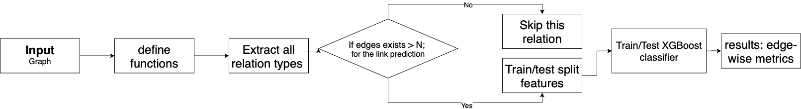
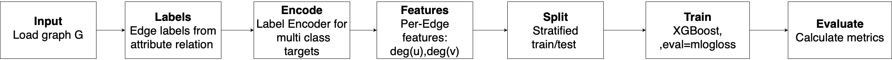
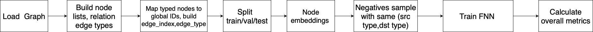
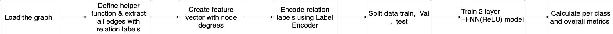
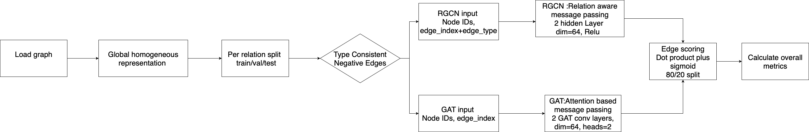
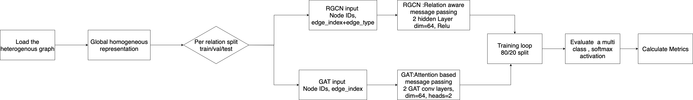

# GRASP: Where Do Graphs Shine? — Hetionet Implementation Workflows

This README documents the experimental workflows and code implementation used for Hetionet-based link prediction and relation classification tasks in **GRASP: Where Do Graphs Shine?**. Each model corresponds to Figures 9 through 14 in the paper, which visually depict the flowcharts and coding pipelines used in the experiments.

---

## 1. XGBoost

XGBoost serves as the baseline model, using feature-engineered graph statistics to predict link existence and classify relation types. Two workflows were implemented: **binary link prediction** and **multi-class edge-type classification**.

### Binary Link Prediction

The pipeline begins with loading the Hetionet graph and extracting all relation types. For each relation, edge features were generated from node degrees and split into training and testing sets. XGBoost was trained using a binary objective to predict whether a link exists.

**Figure – XGBoost Binary Link Prediction Workflow**  
*(xgboost_link_horizontal.pdf)*  

Steps:

1. Load input graph
2. Define helper functions for edge feature extraction
3. Skip relations with insufficient samples
4. Perform stratified train–test split
5. Train XGBoost classifier
6. Evaluate AUC, precision, recall, and F1 per edge type

The model achieved strong results (AUC = 0.9963, F1 = 0.972), confirming that degree-based features capture strong structural cues for binary link prediction.

### Multi-Class Edge-Type Classification

For multi-class prediction, existing edges were labeled by relation type. A label encoder transformed these into numeric targets. 

**Figure – XGBoost Multi-Class Relation Classification Workflow**  
*(xgboost_linktype_horizontal.pdf)*  

Steps:

1. Load graph and extract edge labels
2. Encode labels using a label encoder
3. Compute degree-based features per edge
4. Perform stratified train–test split
5. Train multi-class XGBoost
6. Evaluate precision, recall, and F1 for each class

Despite its success in binary prediction, XGBoost struggled in multi-class classification (overall F1 = 0.26), underscoring the model’s lack of relational inductive bias.

---

## 2. Feedforward Neural Network (FFNN)

The FFNN was designed to test whether a shallow neural model could learn link patterns using embeddings and minimal feature engineering.

### Binary Link Prediction

Each edge was represented by concatenated node embeddings, with type-consistent negative samples for balance. The model was trained using log-loss and optimized with respect to validation F1.

**Figure – FFNN Binary Link Prediction Workflow**  
*(FNN_link_horizontal.pdf)*  

---

Steps:

1. Load the Hetionet graph and prepare node embeddings
2. Map node pairs to global identifiers
3. Generate balanced positive and negative edges
4. Split into training, validation, and test sets
5. Train FFNN classifier
6. Evaluate edge-wise performance metrics

The FFNN achieved moderate performance (F1 = 0.886), showing limited capacity to learn relational structure without explicit graph modeling.

### Multi-Class Relation Classification

This workflow used degree-based features as input to a two-layer dense FFNN trained with cross-entropy loss to predict the relation type.

**Figure – FFNN Multi-Class Relation Classification Workflow**  
*(FFNN_linktype_horizontal.pdf)*  

Steps:

1. Load Hetionet and encode relation labels
2. Create feature vectors using node degrees
3. Split into training, validation, and testing sets
4. Train FFNN with ReLU activation
5. Evaluate class-wise metrics

The FFNN overfitted on majority relations, producing an overall F1 of 0.14. This confirmed that non-relational architectures are ineffective for multi-class link prediction.

---

## 3. Graph Neural Networks (GNNs)

GNNs were applied to leverage Hetionet’s multi-relational structure, incorporating message passing mechanisms that enable relational reasoning. Two architectures were implemented: **Relational Graph Convolutional Network (R-GCN)** and **Graph Attention Network (GAT)**.

---

### 3.1 Relational Graph Convolutional Network (R-GCN)

R-GCN applies relation-specific transformations during message passing, allowing it to model multiple edge types simultaneously.

#### Binary Link Prediction

Positive edges were paired with type-consistent negative samples by corrupting either source or target nodes. The model was trained to score edge likelihoods.

**Figure – R-GCN/GAT Link Prediction Workflow**  
*(GAT_RGCN_link_horizontal.pdf)*  

---

Steps:

1. Load Hetionet and encode node and relation types
2. Create train, validation, and test splits per relation
3. Generate type-consistent negative samples
4. Apply relation-specific message passing layers
5. Compute edge scores and evaluate AUC, precision, recall, and F1

R-GCN maintained stable F1 scores even for minority relations, confirming its ability to capture complex relational patterns.

#### Multi-Class Edge-Type Classification

Node embeddings were concatenated for each edge and passed through a classifier to predict relation type.

**Figure – R-GCN / GAT Multi-Class Relation Classification Workflow**  
*(GAT_RGCN_linktype_horizontal.pdf)*  

Steps:

1. Load and encode graph data
2. Generate degree-based node features
3. Split data into training, validation, and testing sets
4. Apply two-layer R-GCN with ReLU activation
5. Concatenate node embeddings to classify edge type
6. Evaluate metrics per relation

R-GCN demonstrated strong balance across classes and robust relational generalization.

---

### 3.2 Graph Attention Network (GAT)

GAT introduces attention mechanisms that learn to weigh the influence of neighboring nodes dynamically during message passing.

#### Binary Link Prediction

The GAT workflow mirrors the R-GCN setup but replaces relation-specific weights with multi-head attention.

**Figure: GAT Link Prediction Workflow**
*(Corresponds to Figure 13 in the paper)*

Steps:

1. Load Hetionet and unify node indices
2. Split edges per relation into training and testing sets
3. Apply GAT convolution layers with multi-head attention
4. Compute edge scores through similarity operations
5. Evaluate AUC, precision, recall, and F1 across relations

GAT achieved higher recall and competitive F1 (0.719 overall) compared to R-GCN, indicating improved information aggregation.

#### Multi-Class Edge-Type Classification

This workflow reused the same setup as R-GCN but relied on attention-based aggregation.

**Figure: GAT Multi-Class Relation Classification Workflow**
*(Corresponds to Figure 14 in the paper)*

Steps:

1. Encode graph structure and relation labels
2. Generate node embeddings through attention layers
3. Concatenate embeddings for edge representation
4. Pass through a linear softmax classifier
5. Evaluate accuracy, precision, recall, and F1

GAT achieved a weighted F1 of 0.631, outperforming other models in distinguishing relation types, though performance was limited by relation sparsity.

---

## Summary

The Hetionet experiments in GRASP reveal distinct model behaviors across architectures:

* XGBoost efficiently captures structural information for binary tasks but lacks relational reasoning.
* FFNN models simple topological dependencies but cannot generalize relation semantics.
* R-GCN leverages relation-aware message passing for balanced multi-relational learning.
* GAT enhances contextual focus through attention, improving flexibility in heterogeneous graphs.

These experiments establish the foundation for evaluating graph-based reasoning performance in biomedical knowledge graphs.

# Tabular hetnet format

The tabular format requires two tables to represent a hetnet. It also does not include node and edge properties such as the license or attribution and therefore we recommend using our JSON or Neo4j format instead.

## Nodes

`hetionet-v1.0-nodes.tsv` is a table of network nodes, formatted like:

| id                             | name                      | kind               |
|--------------------------------|---------------------------|--------------------|
| Anatomy::UBERON:0000004        | nose                      | Anatomy            |
| Biological Process::GO:0003193 | pulmonary valve formation | Biological Process |
| Gene::3149                     | HMGB3                     | Gene               |
| Symptom::D058447               | Eye Pain                  | Symptom            |

`id` is the node identifier prepended with the node type plus `::` as a separator. `name` is the node name. `kind` is the node type.

## Edges

`hetionet-v1.0-edges.sif.gz` is a gzipped TSV table of network edges, formatted like:

| source                  | metaedge | target                         |
|-------------------------|----------|--------------------------------|
| Gene::9021              | GpBP     | Biological Process::GO:0071357 |
| Anatomy::UBERON:0002081 | AeG      | Gene::8519                     |
| Anatomy::UBERON:0001891 | AeG      | Gene::84281                    |
| Gene::2063              | Gr>G     | Gene::7846                     |

`source` is the source node id as in the node table. `target` is the target node id. `metaedge` is the abbreviation of the edge type.

Hetionet Graph : https://drive.google.com/file/d/1WrakYZTznnl98ox49kprzkhuB1szoNyy/view?usp=sharing
