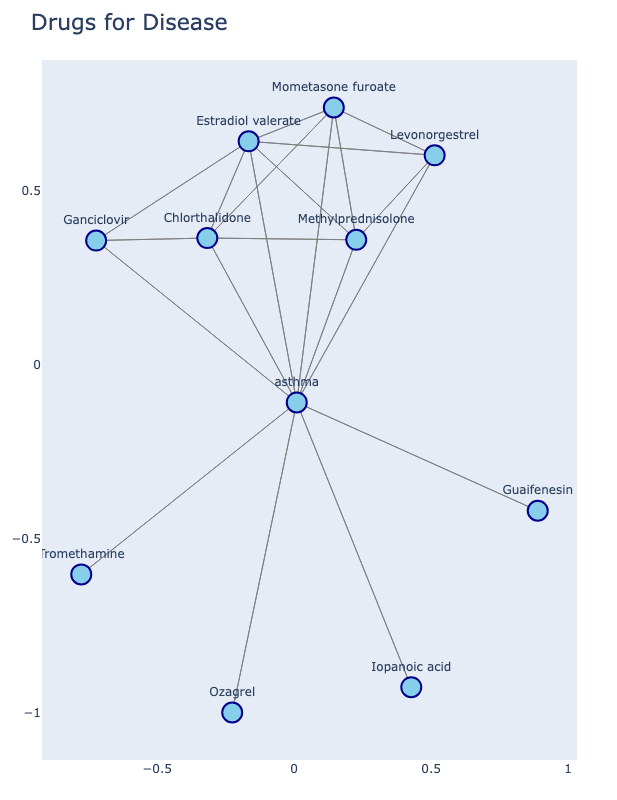
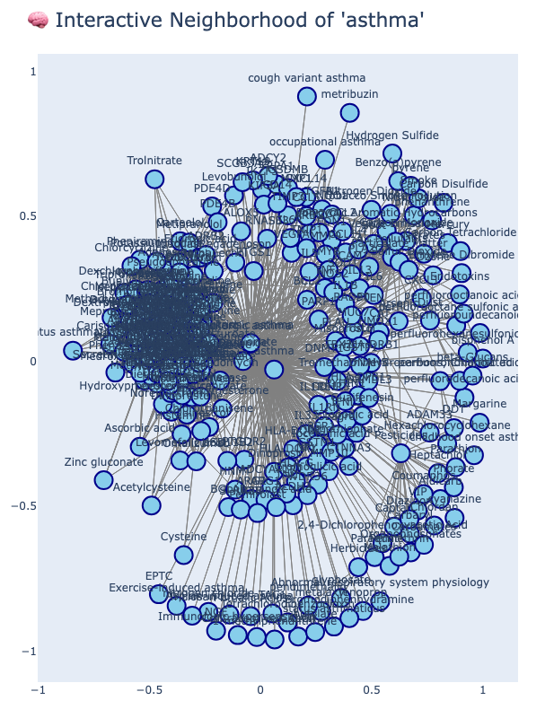
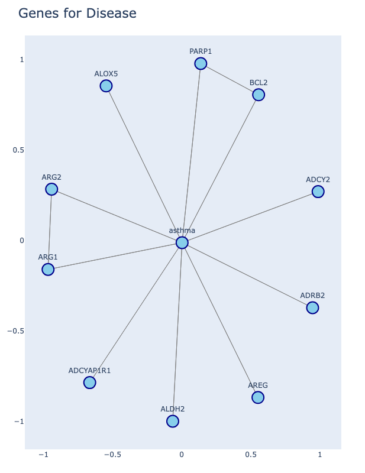
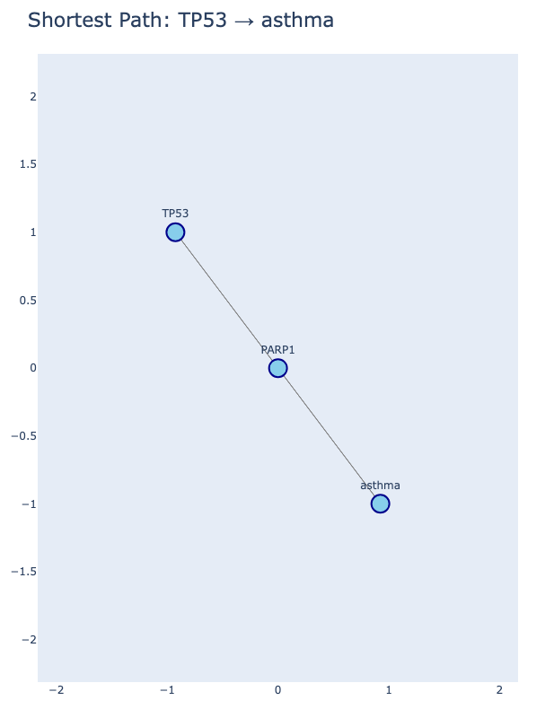
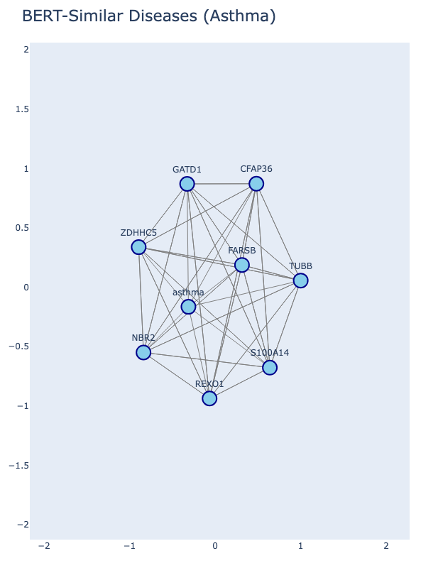

# 🧠 PrimeKG Graph Exploration README

This project constructs and explores a biomedical knowledge graph from the PrimeKG dataset. The workflow involves **data loading**, **graph enrichment**, **quality checks**, and **graph queries** to extract biologically meaningful insights.

---

## 📌 1. Graph Construction

### 🔹 Question:

*How is the initial graph constructed from PrimeKG?*

### ✅ Exact Answer:

The graph is created by reading nodes from `nodes.csv` and edges from `kg.csv`, forming a directed graph.

### 🧠 Explanation:

* Each row in `nodes.csv` contains biomedical entities (drugs, diseases, genes, phenotypes, etc.).
* Each row in `kg.csv` defines a directed relation between two nodes using `x_index` and `y_index`.
* These edges represent semantic relationships like "treats," "causes," or "interacts with."
* A directed graph (`DiGraph`) structure is used to preserve the directionality of relationships (e.g., drug → disease).

---

## 💊 2. Graph Enrichment

### 🔹 Question:

*How is the graph enriched with additional biomedical information?*

### ✅ Exact Answer:

Drug and disease nodes are enriched using feature files: `drug_features.csv` and `disease_features.csv`. BERT-based disease similarity is added from `kg_grouped_diseases_bert_map.csv`.

### 🧠 Explanation:

* The `drug_features.csv` and `disease_features.csv` files provide properties like class, source, mechanism of action, and therapeutic use.
* These properties are added to node attributes to support richer querying.
* The BERT mapping file contains semantic groupings of diseases based on contextual similarity in medical literature.
* New edges are created between similar diseases using a custom `bert_group` relation.

---

## 🧪 3. Graph Quality Checks

### 🎯 3.1 Size

#### 🔹 Question:

*What is the size of the enriched graph?*

#### ✅ Exact Answer:

**129,375** nodes and **8,195,424** edges

#### 🧠 Explanation:

* This includes original edges from `kg.csv` and additional BERT-similarity edges.
* Large edge count reflects complex biological relationships.

---

### 🧬 3.2 Node Type Distribution

#### 🔹 Question:

*What types of biomedical entities are present and in what quantity?*

#### ✅ Exact Answer:

* gene/protein: 27,671
* drug: 7,957
* effect/phenotype: 15,311
* disease: 17,080
* biological\_process: 28,642
* molecular\_function: 11,169
* cellular\_component: 4,176
* exposure: 818
* pathway: 2,516
* anatomy: 14,035

#### 🧠 Explanation:

* Nodes are typed by the `node_type` field in the original `nodes.csv` file.
* A wide variety of biomedical concepts are included to support holistic modeling.

---

### 🔗 3.3 Connectivity

#### 🔹 Question:

*Is the graph fully connected?*

#### ✅ Exact Answer:

* Weakly Connected Components: **1**
* Strongly Connected Components: **1**

#### 🧠 Explanation:

* **Weak connectivity** means you can reach any node from any other if edge directions are ignored.
* **Strong connectivity** implies that a path exists in both directions between any pair of nodes, respecting edge directions.
* Having one of each implies a highly integrated graph.

---

### 🔄 3.4 Random Path Check

#### 🔹 Question:

*Can a random gene be connected to a disease through known biomedical relations?*

#### ✅ Exact Answer:

Yes, for example:
**CDCP1 → substance abuse/dependence → Medroxyprogesterone acetate → myofibroma** (4 steps)

#### 🧠 Explanation:

* A random gene and disease are selected.
* A path is traced using NetworkX's shortest path function.
* This tests connectivity and meaningful multi-hop reasoning.

---

### 📈 3.5 Degree Distribution

#### 🔹 Question:

*What is the range of node degrees in the graph?*

#### ✅ Exact Answer:

* Min Degree: **2**
* Max Degree: **34,710**
* Average Degree: **126.69**

#### 🧠 Explanation:

* **Degree** is the number of edges connected to a node.
* High-degree nodes (e.g., common diseases or hub genes) can dominate connectivity.
* Helps identify central or peripheral entities.

---

## 🔍 4. Graph Querying

### 💊 4.1 Drugs for a Disease

#### 🔹 Question:

*What drugs are used to treat asthma?*

#### ✅ Exact Answer:

Top drugs include: Estradiol valerate, Iopanoic acid, Guaifenesin, Mometasone furoate, Methylprednisolone

#### 🧠 Explanation:

* Query checks neighbors of "asthma" node that are of type `drug`.
* Captures known therapeutic relationships.

---

### 🧬 4.2 Genes for a Disease

#### 🔹 Question:

*What genes are associated with asthma?*

#### ✅ Exact Answer:

Examples: ADCY2, ADCYAP1R1, PARP1, ADRB2, ALDH2

#### 🧠 Explanation:

* Identifies genes involved in the pathophysiology or risk factors for asthma.
* Useful for biomarker discovery or genetic studies.

---

### 🔗 4.3 Shortest Path

#### 🔹 Question:

*What is the shortest path from gene TP53 to asthma?*

#### ✅ Exact Answer:

**TP53 → PARP1 → asthma** (3 steps)

#### 🧠 Explanation:

* Uses graph traversal to determine interaction chains.
* Highlights indirect influence from regulatory genes to diseases.

---

### 🧠 4.4 BERT-Similar Diseases

#### 🔹 Question:

*What diseases are semantically similar to asthma using BERT?*

#### ✅ Exact Answer:

ZDHHC5, TUBB, NBR2, FARSB, CFAP36, S100A14, REXO1, GATD1

#### 🧠 Explanation:

* These diseases appear in the same BERT cluster as asthma.
* BERT embeddings capture language-level similarity from literature.

---

### ⚠️ 4.5 Shared Side Effects

#### 🔹 Question:

*Which drugs share side effects with albuterol?*

#### ✅ Exact Answer:

❌ No shared side-effect drugs found.

#### 🧠 Explanation:

* Albuterol's side-effect nodes are checked.
* Other drugs linked to the same phenotypes are collected.
* None were found in this instance.

---

## 💾 5. Graph Saving

### 🔹 Question:

*Graph saved for reuse!*

### ✅ Exact Answer:

Yes, saved as: `primekg_graph.pkl`

### 🧠 Explanation:

* Serialized using Python's `pickle` module.
* Enables fast reloading without reconstructing the graph each time.

